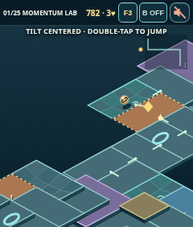
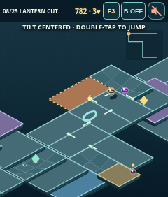
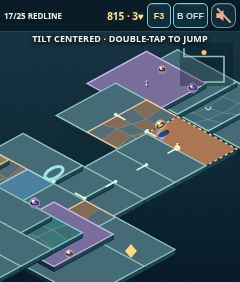
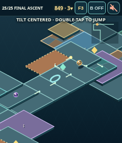

# Marble Madness 3D · Momentum Lab — R1 Creation

This updates the **existing 3D project**, not the separate 2D game. Twenty-five named courses now consist of three large, multi-directional hand-authored route motifs per course, selected and mirrored in course-specific combinations. Each route includes sharp lateral traverses, switchbacks, broad interconnected platforms, optional plaza detours and a compact translucent route trace and surface-anchored directional marks. The goal is no longer at the end of a repeated straight strip. Pro repeats the spatial module structure to approximately double route length. This is projected canvas geometry, not WebGL or a full 3D rigid-body simulation.

## Actual gameplay screenshots

Captured from the updated running browser build at the R1's **240×282** viewport (not concept art). The marble is positioned on each indicated surface in the local browser fixture; physical R1 rendering is not yet verified.

| Banked bend · course 1 | Bowl · course 8 | Curved ramp · course 17 | Banked bend · course 25 |
|---|---|---|---|
|  |  |  |  |

The bank, bowl and ramp are **height-field support**, not markings on a flat floor. A small projected mesh renders the same surface function that sets marble height and downhill acceleration. The relief tapers to zero at tile edges, allowing adjacent supports to join while uncovered gaps still cause falls. Every course and difficulty includes all three forms; the existing moving, elevator and fragile supports remain.

## Play and mechanics

Choose a course and difficulty. Hold the device in a neutral playing posture and start; **tilt is required** to steer, and the clock waits for orientation data. Double-tap the playfield to jump. Tap **B OFF / B ON** in the top scoreboard to toggle the brake; its highlighted state persists until tapped again, and resets at the start of a course. Adjust **FORCE 1–5** with wheel events, or tap/swipe **F1–F5** in the scoreboard when wheel events are unavailable. There is no standalone on-screen BRAKE button. Swipe left from the right edge to open the pause drawer and swipe right to close. The speaker icon toggles audio, initially muted. Follow the small translucent route trace and illuminated floor arrows; a dark gap has no support, while adjacent plaza surfaces are optional detours. Blue ↔ means moving, purple ↕ means a height-changing elevator, and orange ! warns of collapse.

Blue moving platforms oscillate sideways and carry the marble while supported. Purple elevators raise/lower the support surface 3 world units and prevent entry onto a platform more than 1.15 units above the player's current support unless jumping. Orange fragile platforms warn in red after 2.2 seconds of residence and fall away after 4.5 seconds; they reset on respawn. A missing support surface, bomb, or collapsed platform consumes a life and respawns at the latest safe checkpoint with a four-second penalty. Posts and moving rivals deflect the marble. Diamonds give time, shield, or forward boost. The course ends at the goal platform.

| Level | Lives | Hazards | Rivals | Bonuses | Length |
|---|---:|---:|---:|---:|---:|
| Beginner | 5 | half Standard, odd rounded up | none | twice Standard | baseline |
| Standard | 3 | baseline | baseline | baseline | baseline |
| Pro | 1 | twice Standard | twice Standard | twice Standard | approximately twice baseline |

## Audio and credits

The bundled mono 16 kHz MP3 samples are adapted from the **Kenney Impact Sounds** pack: <https://kenney.nl/assets/impact-sounds>, released under **Creative Commons CC0 1.0** (<https://creativecommons.org/publicdomain/zero/1.0/>). The original pack's license is preserved at `assets/LICENSE.txt`. Concrete and wood footstep recordings provide material-dependent rolling texture; recorded impact, plate, tin, glass, bell and wood samples cue collisions, moving supports, elevator, warning/collapse, jump, pickups, checkpoint, bomb and finish. These are sampled foley effects, not oscillator beep tones. Attribution is provided voluntarily. Audio loads lazily after unmute; missing/unsupported samples fail silently for gameplay, and mute suspends playback. Total bundled audio is about 56 KB.

## Verification and known limitations

Run `node controls-test.mjs`, `node campaign-test.mjs`, `node route-test.mjs`, and `node audio-test.mjs`. Serve the directory using `python3 -m http.server 8765` and run `node browser-test.mjs` for four representative 240×282 screenshots under `screenshots/`. Run `node physics-test.mjs` and `node route-test.mjs` for surface dynamics and deterministic steering. Campaign tests check all 75 course/difficulty combinations for rule counts, connectivity, occupancy at three animation times, turns, dynamic behavior, collapse/respawn, bomb, feature and finish. There are 25 distinct route signatures. The previous 32/75 steering result improved to **74/75** after relocating bombs off the steering corridor, showing that the majority of failures were hazard-placement artifacts rather than route disconnections. The last failure involved a rival stalling the simplistic controller on a collapsing platform and then a checkpoint loop; relocating rivals off collapsing supports yielded **75/75** deterministic probe finishes. This does not establish human beatability or a robust route guarantee under varied steering and timing. The geometry tests establish adjacent platforms, not human-scale navigability. The 240×282 browser fixtures render courses 1, 8, 17 and 25; the sampled audio harness decodes all 13 assets, calls every event, and confirms mute suppression in a mocked AudioContext—not actual speaker output. Physical R1 tilt-axis behavior, side-button delivery, wheel handling, sound playback, performance, and course balance require Rodney's on-device acceptance testing after installation. This release is not a Gallery submission.

## Install on R1

Scan this release-specific Creation QR with the R1 to install the published game, or open the [release-specific Creation URL](https://geekthegreybeard.github.io/r1-marble-madness-3d/?release=20260927-hud-brake). This QR is refreshed with each published release and decoded against the Creation card before delivery.

## Hardware input boundary

The embedded R1 Creation runtime's delivery of the physical side-button and wheel to page JavaScript is not documented in the public [r1 Creations page](https://www.rabbit.tech/creations). A browser can consume standard `wheel` events, but browser simulation cannot prove the R1 forwards its wheel; the scoreboard F control is a touch fallback. Do **not** remap the system push-to-talk side-button to an unverified `keydown` event: B is a keyboard simulation shortcut, not proof of hardware support. Until the runtime exposes and documents a side-button event that does not conflict with system push-to-talk, B ON/OFF in the scoreboard is the reliable touch fallback. Physical R1 button/wheel validation remains pending.

## R1 acceptance check for Rodney

1. Install from the release QR and open course 1 on Beginner; confirm the course is visible behind the small translucent trace, floor dots/arrows stay on real surfaces, dark gaps remain visually distinct, and ↔/↕/! cues match platform behavior.
2. Tilt all four ways, change FORCE with the wheel (or touch fallback), toggle B ON/OFF in the scoreboard, double-tap to jump, and swipe the drawer open/closed; confirm there is no D-pad or tilt toggle.
3. Cross a moving support, wait for an elevator and jump if raised, then linger on a fragile support for its red warning/collapse; test checkpoint respawn. Try course 25 Standard for its turn/rival timing.
4. Unmute and listen for rolling, jump, impact, elevator, fragile warning/collapse, pickup and finish; mute and ensure effects cease. Report any clipping, inaudible events, occluded hazards, or routes you cannot traverse, with course/level and location.
